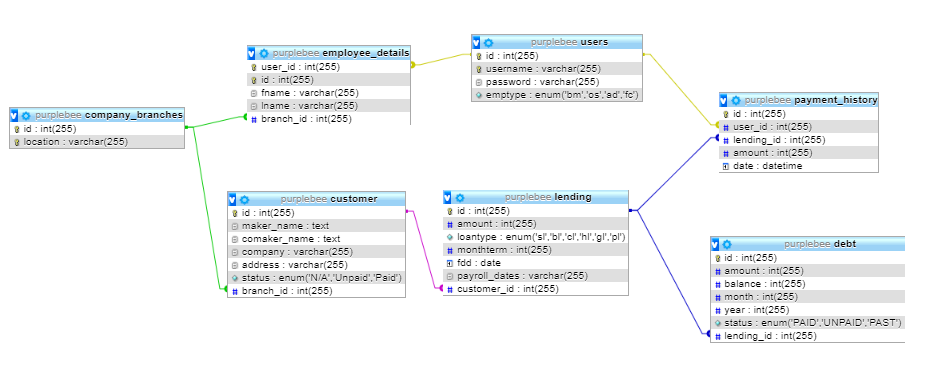

# Purplebee Lending Management System
## Quick Introduction
A Simple College Project

### Table of Contents
* [Database Structure](#database-structure)
* [Future Update](#future-updates) 
* [List of Accounts](#list-of-accounts)
* [Administrator Pages](#administrator-pages)
* [Branch Manager Pages](#branch-manager-pages)
* [Field Collector Pages](#field-collector-pages)
* [Office Staff Pages](#office-staff-pages)

## Database Structure
Database Realationships:

## Future Updates
* Remove Office Staff.
* Change Branch Manager Monthly Interest.
* Add Monthly Branch Manager Report.
* Remove Old Field Collector Page.
* Create New Field Collector Page.
* Add Field Collector's Own Client Management System.
* Add Field Collector's Monthly Report.
* Add Field Collector's Daily Report.
* Add Field Collector's Own Saving Management System.
* Add Field Collector's Printable Page.
* Create More Effective Administrator Page Report.
* Add Adminstrator Graph Report.
* Add Branch Manager Generate Excel Report.

## List of Accounts
1. Administrator 
2. Branch Manager
3. Field Collector
4. Office Staff

## Administrator Pages
1. Branch List `/admin/branches`
2. Account List `/admin/accounts`
3. Change Password `/admin/password`

## Branch Manager Pages
1. Customer List `/bm/customers`
2. Pay Bill `/bm/pay`
3. Change Password `/bm/password`

## Field Collector Pages
1. Pay Bill `/fc/pay`
2. Report `/fc/report`
3. Change Password `/fc/password`

## Office Staff Pages
1. Print  `/os/print`
2. Change Password `/os/password`